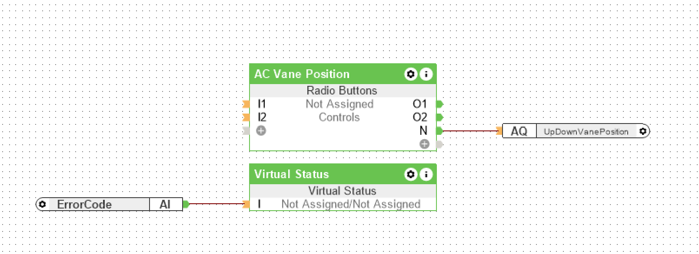
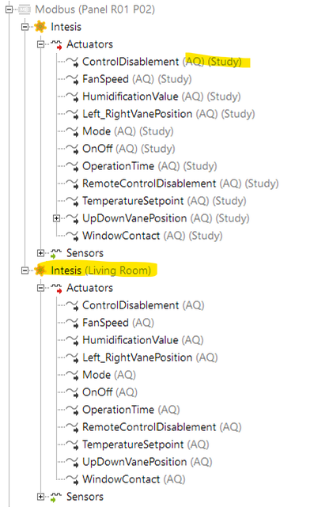
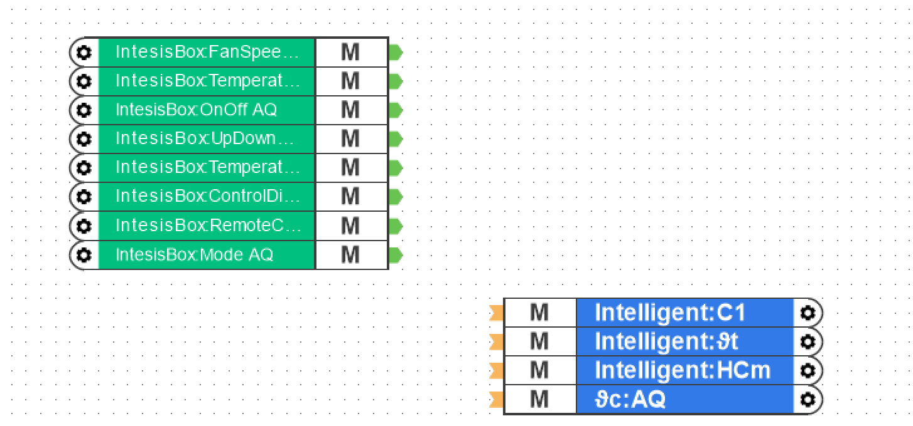
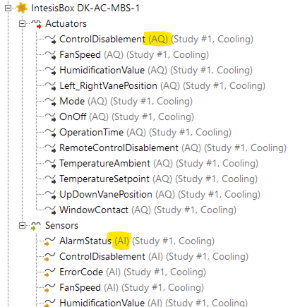
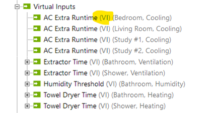
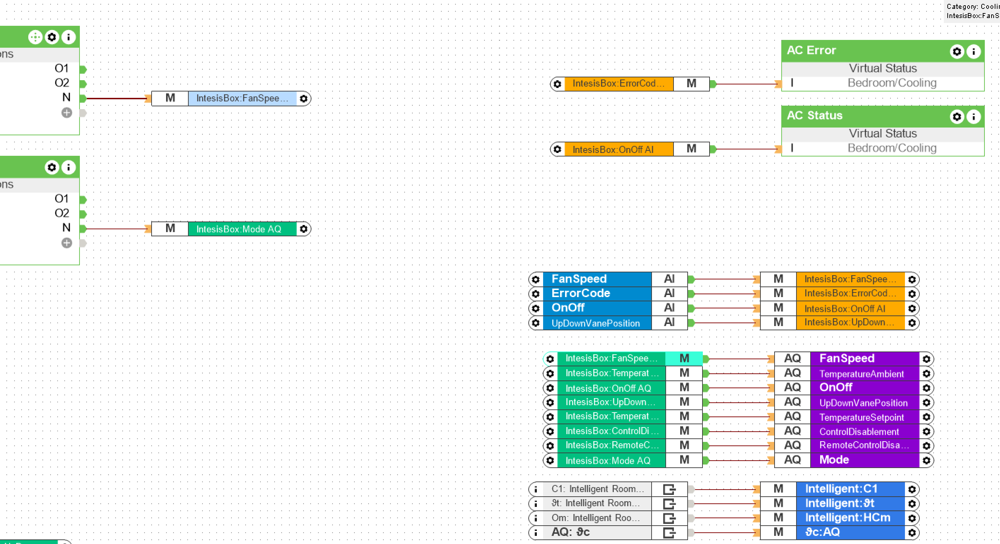

# What's this?

LoxTemplater ((**Lox**one**Templater**) is a tool to help you reusing complex logic for rooms in Loxone Config.

# How?

1. The tool will take specified ("template") page in your project
2. Replaces Memory Flags with actual device I/O ports assigned to the given room
3. Adds the new page to your project

# How, but with pictures

## 1. Initial Logic
Create the logic (e.g. AC automation) for a single room, using actual devices. Test it.

## 2. Clean Up Devices & Function Blocks

Ensure that devices and their outputs are

1. named consistently; they must be named the same for each room
2. are assigned to the rooms you want to generate a page for
3. in some cases it's enough to assign the parent device to the room (see picture)

## 3. Convert to Template

1. Every I/O (device sensors, actuators, output of other function blocks, like AQt of the Room Controller), that you want to assign per room, must be replaced with a Memory Flag (Merker).
2. Depending on the direction of the I/O, either the Memory Flag or its Input Reference needs to be used
3. Finally, place a new, disconnected Memory Flag for each IO; the tool will (try to) connect the actual IO ports here

- The Green Memory Flags (Input References) will send data to Actuators, or inputs of Function Blocks
- The Blue Memory Flags receive data from Sensors or outputs of Function Blocks

### Naming

The general template is

    Device or BlockName:Port Name

- Device or Block name:
    - For most extensions, it's the name of the extension, e.g. `AO Extension`
    - For Modbus, it's the name of the Modbus device (e.g. `IntesisBox xxxx`)
    - For the Miniserver, it's the name of the server, as listed in the Device Tree
    - For Function Blocks or Memory Flags, the name of the block/flag
    - The tool supports prefix matching, so it's enough to write `Intesis`, to match the device `IntesisBox DK-AC-MBS-1`
- Port Name:
    - Whatever is displayed in the device tree, or on the function block (e.g. `HC1`, `Shd` or `ϑt`)
    - Except, some IOs have suffix (which is also displayed in the Device Tree)
        - Modbus Actuators have the suffix `AQ`, e.g. `OnOff AQ`
        - Modbus Sensors have the suffix `AI`, e.g. `OnOff AI`
        - Virtual Inputs have the suffix `VI`

E.g.:

- `MyMiniserver:External Temperature Threshold VI`
- `Intelligent:HCm`
- `IntesisBox:FanSpeed AI`

### Examples

The blue inputs will be connected to:

- ϑt, C1, and HCm outputs of the Intelligent Room Controller
- The output (`AQ`) of the Memory Flag ϑc
    - (This is based on **name only**, but in my template ϑc is a Mmeory Flag, not, e.g. Radio16)

## 4. Run the tool

Basic example:

    LoxTemplater generate --rooms Attic Study --template "_Template1" c:\path\to\the\Project.Loxone

This will generate pages for Attic and Study, based on the page _Template1 and the output wil be saved next to the project file (with a timestamp in the name).

E.g:

After running the tool on a moderately complex tenmplate:

- Top-left block of AIs
- Purple AQs in the middle
- Bottom-left gray links 

were all placed there by the tool.

# Usage

Use the `help` command to get more information.

    ❯ LoxTemplater help
    LoxTemplater 1.0.0
    (c) 2022 enyim.com, Attila Kiskó

    list        List entities in the project file

    generate    Generate pages based on the specified template

    help        Display more information on a specific command.

    version     Display version information.

All parameters for the `generate` command:

    ❯ LoxTemplater help generate
    LoxTemplater 1.0.0
    (c) 2022 enyim.com, Attila Kiskó
    USAGE:
    Generate a page for Attic from AC_Template:
    LoxTemplater generate --output path/to/saved/file.Loxone --rooms Attic --template AC_Template
    path/to/the/project.Loxone

    -r, --rooms          Required. Which rooms to generate pages for. Use 'list rooms' to get the list of room names from
                        the project.

    -t, --template       Required. Name of the template page.

    --page-name          Template for naming the generated pages. Use {Room} for the room name. E.g. "Heating - {Room}"

    -o, --output         Target path for saving the project. If not specified a generated file name will be used.

    -n, --dry-run        If set, the output will not be saved. Can be used for validating the source project.

    --overwrite-pages    If set, pages with the same name as the generated pages will be overwritten in the project file.
                        Useful when reprocessing a project that contains both template and generated pages.

    --delete-template    If set, the template page will be removed from the output project.

    --help               Display this help screen.

    --version            Display version information.

    PATH (pos. 0)        Required. Path to the source project file

# Supported Devices and Function Blocks

As of now, the tool supports the following

- Modbus Devices
- Virtual Inputs
- Memory Flags
- Intelligent Room Controller

Adding more is a matter of defining the POCO class for the extension/device and adding some extra logic to `IOCollector`.
